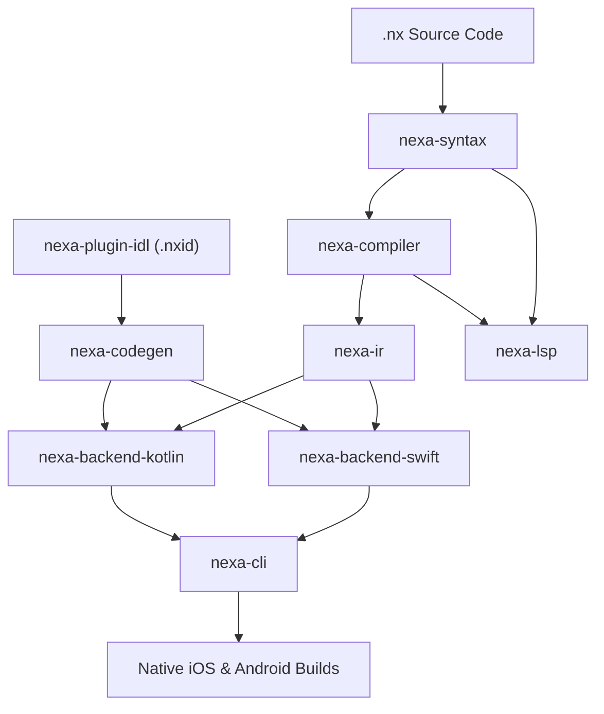

# Nexa Agent Guide (`AGENTS.md`)

Welcome to the Nexa codebase. This document is the single source of truth and mission control for AI agents and human contributors working on Nexa.

---

## 1. What is Nexa?

**Nexa** is an ultra-high-performance Ahead-Of-Time (AOT) transpiler that compiles `.nx` mobile applications directly into native **Swift (SwiftUI)** for iOS and **Kotlin (Jetpack Compose)** for Android.

### Core Objectives:
1. **Uncompromised Performance**: Generate native code that matches or exceeds hand-written Swift and Kotlin. Zero runtime overhead, zero reflection, zero dynamic interpretation.
2. **Minimal Binary Footprint**: No bundled heavyweight runtime engines, JavaScript engines, or embedded interpreters. Applications compile directly against standard platform UI frameworks.
3. **Single Cross-Platform Codebase**: Write modern declarative `.nx` code without having to maintain separate Swift and Kotlin app codebases.
4. **Zero-Cost Native Plugin System**: Strongly-typed native plugin contracts (`.nxid`) supporting direct Swift, Kotlin, and high-performance C++ implementations with zero-copy buffer views and deterministic lifecycle management.

---

## 2. Repository Layout & Crate Architecture

The workspace is structured into specialized, decoupled crates under `crates/`:

```
crates/
├── nexa-syntax/          # Lexer and recursive descent parser; builds AST from .nx source
├── nexa-diagnostics/     # Source spans, compiler errors, and non-fatal warnings
├── nexa-ir/              # Typed, platform-independent Intermediate Representation & IR walker
├── nexa-compiler/        # Semantic analysis, type inference, component validation, and IR optimization
├── nexa-plugin-idl/      # Native plugin contract schema parser and semantic validator (.nxid)
├── nexa-codegen/         # Shared native naming conventions, TargetPlatform, and plugin codegen (Swift, Kotlin, C++)
├── nexa-backend-swift/   # SwiftUI generator (API, components, features, state, views)
├── nexa-backend-kotlin/  # Jetpack Compose generator (API, components, features, state, composables)
├── nexa-lsp/             # Language Server Protocol 3.17 implementation (IDE tooling)
└── nexa-cli/             # Command-line interface (`nexa run`, `build`, `generate`, `audit`, `plugin`)
```

### Dependency Flow:


---

## 3. Strict Coding Standards & Invariants

When contributing to Nexa, agents must adhere strictly to these principles:

1. **Zero Runtime Reflection or Boxing**:
   - Never introduce `AnyMap`, untyped hash maps for parameters, or dynamic string reflection into generated output.
   - All properties, arguments, and return types must be statically typed in the IR.
2. **No `unwrap()` in Production Paths**:
   - Compiler, parser, and code generators must return structured errors (`CompileError`, `Result<T, E>`). Never panic during user compilation.
3. **Avoid Type Erasure in Generated UI**:
   - In Swift: Never use `AnyView` in hot paths or virtualized lists (`NexaFastList`, `NexaFastSectionedList`). Specialize views using generic arguments (e.g. `HeaderContent: View = EmptyView`).
   - In Kotlin: Never box primitive state types. Use `mutableDoubleStateOf`, `mutableIntStateOf`, `mutableLongStateOf` instead of generic `mutableStateOf<Double>`.
4. **Explicit Error Handling**:
   - Nexa uses Rust-style `Result<T, E>` with the `?` postfix propagation operator. Functions and expressions must avoid hidden unchecked exception paths.
5. **Deterministic Scaffolding**:
   - Scaffolding templates in `nexa-cli` and `nexa-codegen` must be strictly deterministic and idempotent.

---

## 4. AI Agent Skills & Context Routing

Nexa provides specialized AI agent skills located under `.agents/skills/`. Agents working in this repository should leverage these domain-specific skill guides:

### Available Skills:
1. **[`nexa-app`](file:///.agents/skills/nexa-app/SKILL.md)**:
   - **Role**: Application Architect & Developer
   - **When to Use**: Authoring, refactoring, or troubleshooting mobile applications in `.nx`. Use when the goal is to build cross-platform features without writing manual Swift or Kotlin code.
   - **Key Resources**: `examples/`, [`docs/language-guide.md`](file:///docs/language-guide.md), [`docs/components.md`](file:///docs/components.md).

2. **[`nexa-framework`](file:///.agents/skills/nexa-framework/SKILL.md)**:
   - **Role**: Compiler & Systems Engineer
   - **When to Use**: Modifying the Nexa Rust compiler, AST parser (`nexa-syntax`), typed intermediate representation (`nexa-ir`), CLI (`nexa-cli`), Swift backend (`nexa-backend-swift`), Kotlin backend (`nexa-backend-kotlin`), or language server (`nexa-lsp`).
   - **Key Resources**: `crates/`, [`docs/architecture.md`](file:///docs/architecture.md).

3. **[`nexa-plugin`](file:///.agents/skills/nexa-plugin/SKILL.md)**:
   - **Role**: Native Plugin & Systems Specialist
   - **When to Use**: Designing or implementing strongly-typed native plugins (`.nxid`), platform integrations in Swift / Kotlin, or high-performance C++ native libraries.
   - **Key Resources**: `crates/nexa-plugin-idl/`, `crates/nexa-codegen/`, `examples/plugins/`, [`docs/plugins.md`](file:///docs/plugins.md).

4. **[`nexa-performance`](file:///.agents/skills/nexa-performance/SKILL.md)**:
   - **Role**: Performance & Memory Profiler
   - **When to Use**: Eliminating heap allocations, avoiding view type erasure (`AnyView`), unboxing Kotlin states, profiling virtualized list scrolls, or optimizing zero-copy C++ buffers.
   - **Key Resources**: `crates/nexa-backend-*/`, [`.agents/learnings.md`](file:///.agents/learnings.md), [`docs/architecture.md`](file:///docs/architecture.md).

### Routing Matrix:

| Task Type | Relevant Skill | Primary Code / Docs Location |
|---|---|---|
| **Authoring `.nx` Apps** | [`nexa-app`](file:///.agents/skills/nexa-app/SKILL.md) | `examples/`, [`docs/language-guide.md`](file:///docs/language-guide.md) |
| **Compiler, AST, IR, or Backends** | [`nexa-framework`](file:///.agents/skills/nexa-framework/SKILL.md) | `crates/nexa-compiler/`, `crates/nexa-ir/`, [`docs/architecture.md`](file:///docs/architecture.md) |
| **Native Plugins (Swift, Kotlin, C++)** | [`nexa-plugin`](file:///.agents/skills/nexa-plugin/SKILL.md) | `crates/nexa-plugin-idl/`, `crates/nexa-codegen/`, [`docs/plugins.md`](file:///docs/plugins.md) |
| **Performance Profiling & Optimization** | [`nexa-performance`](file:///.agents/skills/nexa-performance/SKILL.md) | `crates/nexa-backend-*/`, [`.agents/learnings.md`](file:///.agents/learnings.md) |

---

## 5. Verification Commands

Before concluding any change, agents must run and verify:

```bash
# 1. Type checking across all workspace crates and targets
cargo check --workspace --all-targets

# 2. Strict linter verification
cargo clippy --workspace --all-targets

# 3. Complete test suite execution
cargo test --workspace
```
