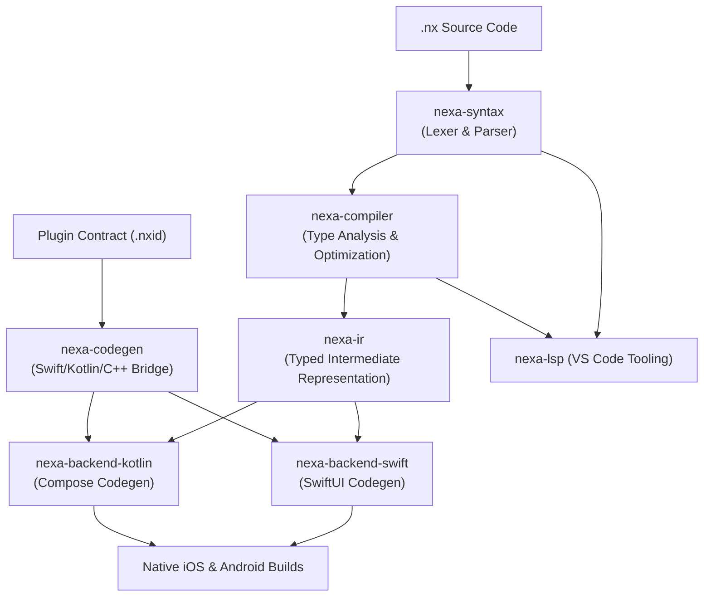

# Nexa ⚡

**Ultra-high-performance Ahead-Of-Time (AOT) transpiler compiling declarative `.nx` apps directly into native Swift (SwiftUI) and Kotlin (Jetpack Compose).**

[]()
[]()
[]()
[]()
[]()

---

## What is Nexa?

Nexa is a cross-platform mobile language designed to generate native iOS and Android apps from one codebase.

Nexa does not bundle a cross-platform UI runtime or JavaScript bridge. The compiler transpiles `.nx` views and state logic ahead-of-time into:
- Idiomatic, type-specialized **Swift (SwiftUI)** for iOS
- Idiomatic **Kotlin (Jetpack Compose)** for Android

---

## Key Pillars

- 🚀 **No Bundled Cross-Platform Runtime**: Nexa does not package a JavaScript engine or its own interpreter; generated apps use the platform's native UI frameworks and toolchains.
- ⚡ **Native Code Generation**: Generates SwiftUI and Jetpack Compose code; numeric state uses primitive-specialized Compose holders where supported.
- 🛡️ **Typed Error Handling**: First-class `Result<T, E>` values and a postfix `?` operator with target-specific error propagation behavior.
- 🔌 **Typed Native Plugin System**: Strongly typed native plugin contracts (`.nxid`) with generated Swift, Kotlin, and **C++20** bindings.
- 💻 **First-Class IDE Experience**: Built-in Language Server Protocol 3.17 server (`nexa-lsp`) and VS Code extension providing real-time diagnostics, autocompletion, hover docs, and document symbols.

---

## Architecture Pipeline



---

## Quickstart

### 1. Installation
Clone the repository and build the CLI tool:

```bash
git clone https://github.com/nexa-lang/nexa.git
cd nexa
cargo build --release -p nexa-cli
sudo cp target/release/nexa /usr/local/bin/
```

### 2. Create and run an App

```bash
nexa create Counter
cd Counter
nexa check
nexa dev
```

`nexa check` type-checks both platforms without requiring native toolchains. `nexa dev` generates native projects under `build/`, builds them, and launches on available simulators or emulators. It stays active and watches `.nx` files. The debug renderer hot reloads layouts, text, state, actions, synchronous app-local functions, and stack navigation. Plugin, dependency, asset, and native-host changes wait for the user to press `b`; they never force a rebuild or relaunch. Press `r` to hot reload, `Shift+R` to hot restart and reset app state, or `b` to rebuild and relaunch the native app. Use `nexa dev --once` in scripts to explicitly build and launch without starting the watcher. Use `nexa dev --ios` or `nexa dev --android` to select one platform. Add `--flavor staging` (or the `--staging` shorthand) to `dev`, `test`, or `release` for a separate identity such as `dev.nexa.myapp.staging`. Define each flavor directly inside `nexa.config.nx` with an optional suffix, for example `flavors { staging { suffix: "staging" }, production { suffix: "" } }`. A flavor without an explicit suffix uses its name. Run `nexa test` for headless native compilation, `nexa release` for an iOS archive/IPA and signed Android AAB, and `nexa doctor` to inspect platform tooling.

Edit `App.nx` and `nexa.config.nx`. The latter configures app IDs, versions, SDK versions, permissions, and shared or platform-specific assets.

---

## Code Example: Counter App

```nexa
app Counter {
    state count: Int32 = 0

    body {
        Column(spacing: 16) {
            Text("Nexa Counter Demo")
            Text(count)

            Row(spacing: 12) {
                Button("Increment") {
                    count = count + 1
                }
                Button("Reset") {
                    count = 0
                }
            }

            if count > 10 {
                Text("Double digits reached!")
            }
        }
    }
}
```

---

## Documentation

Comprehensive guides are available in [`docs/`](docs/):

- 🚀 [**Getting Started**](docs/getting-started.md): Installation, project structure, and CLI workflow.
- 📖 [**Language Guide**](docs/language-guide.md): Syntax, static types, collections, state, and `Result<T, E>`.
- 🧩 [**Component Reference**](docs/components.md): Built-in layout containers, interactive controls, and styling modifiers.
- 🧭 [**State & Navigation**](docs/state-and-navigation.md): Reactive state, navigation stacks, screen routing, and lifecycle events.
- 🔌 [**Native Plugins (Swift, Kotlin, C++)**](docs/plugins.md): Typed native contracts, C++ integration, and platform APIs.
- 🏗️ [**Architecture & Performance**](docs/architecture.md): Deep dive into compiler internals, memory layout, and benchmarks.

---

## Curated Examples

Explore real-world examples in [`examples/`](examples/):

- [`counter.nx`](examples/counter.nx): Minimal reactive starter app.
- [`todo_app.nx`](examples/todo_app.nx): Full task manager with custom components, inputs, and validation.
- [`virtual_list.nx`](examples/virtual_list.nx): Ultra-high-performance virtualized list of 50,000 items with zero `AnyView` overhead.
- [`showcase.nx`](examples/showcase.nx): Component catalog covering inputs, switches, cards, and gestures.
- [`navigation.nx`](examples/navigation.nx): Multi-screen routing with navigation stacks and route parameters.
- [`plugins/video-player/`](examples/plugins/video-player/): Native Swift & Kotlin plugin with AVPlayer and ExoPlayer.
- [`plugins/fast-math/`](examples/plugins/fast-math/): Modern C++ (`c++20`) plugin demonstrating typed native bindings.

---

## Workspace Verification

To verify the entire compiler workspace:

```bash
# 1. Type checking across all 13 crates
cargo check --workspace --all-targets

# 2. Strict linter verification
cargo clippy --workspace --all-targets

# 3. Complete test suite
cargo test --workspace
```

---

## License

Nexa is open-source software licensed under the Mozilla Public License 2.0. See [LICENSE](LICENSE) for the full text.
