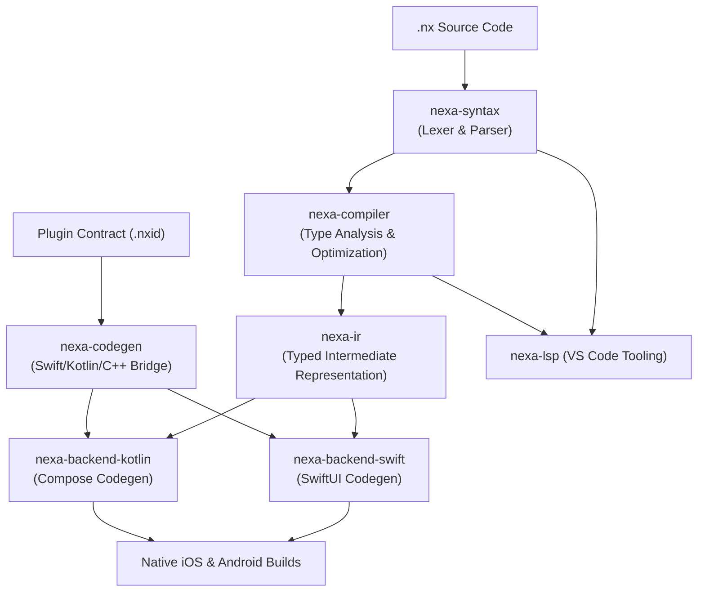

# Nexa ⚡

**Ultra-high-performance Ahead-Of-Time (AOT) transpiler compiling declarative `.nx` apps directly into native Swift (SwiftUI) and Kotlin (Jetpack Compose).**

[]()
[]()
[]()
[]()
[]()

---

## What is Nexa?

Nexa is a single cross-platform mobile language designed to achieve **native or better-than-native performance** without maintaining two separate codebases.

Unlike Flutter or React Native, **Nexa has no bundled runtime engine, no virtual machine, and no JavaScript bridge**. Instead, the Nexa compiler transpiles your `.nx` declarative views and state logic ahead-of-time directly into:
- Idiomatic, type-specialized **Swift (SwiftUI)** for iOS
- Idiomatic, unboxed **Kotlin (Jetpack Compose)** for Android

---

## Key Pillars

- 🚀 **Zero Runtime Overhead**: No Dart VM, no JavaScript engines (JSC/Hermes), no reflection. Generated binaries compile directly against Apple's and Google's standard platform toolchains.
- ⚡ **Better-Than-Native Performance**:
  - **Swift**: Zero `AnyView` type-erasure in layout trees; specialized generic containers preserve structural identity diffing during scrolling.
  - **Kotlin**: Zero primitive state boxing (`mutableIntStateOf`, `mutableDoubleStateOf` instead of generic `mutableStateOf<T>`).
- 🛡️ **Explicit Error Handling**: First-class `Result<T, E>` types and postfix `?` error propagation operator with zero unchecked exception overhead.
- 🔌 **Zero-Cost Native Plugin System**: Strongly-typed native plugin contracts (`.nxid`) supporting direct Swift, Kotlin, and high-performance **C++20** implementations with zero-copy buffers.
- 💻 **First-Class IDE Experience**: Built-in Language Server Protocol 3.17 server (`nexa-lsp`) and VS Code extension providing real-time diagnostics, autocompletion, hover docs, and document symbols.

---

## Architecture Pipeline



---

## Quickstart

### 1. Installation
Clone the repository and build the CLI tool:

```bash
git clone https://github.com/nexa-lang/nexa.git
cd nexa
cargo build --release -p nexa-cli
sudo cp target/release/nexa /usr/local/bin/
```

### 2. Verify and Build an App

Check syntax and semantic types:
```bash
nexa check examples/counter.nx
```

Transpile directly to native Swift or Kotlin:
```bash
# Generate SwiftUI
nexa build examples/counter.nx --target swift --out CounterView.swift

# Generate Jetpack Compose
nexa build examples/counter.nx --target kotlin --out CounterScreen.kt
```

### 3. Run on Simulators

```bash
# Run on iOS Simulator
nexa run examples/counter.nx --target ios

# Run on Android Emulator
nexa run examples/counter.nx --target android
```

---

## Code Example: Counter App

```nexa
app Counter {
    state count: Int32 = 0

    body {
        Column(spacing: 16) {
            Text("Nexa Counter Demo")
            Text(count)

            Row(spacing: 12) {
                Button("Increment") {
                    count = count + 1
                }
                Button("Reset") {
                    count = 0
                }
            }

            if count > 10 {
                Text("Double digits reached!")
            }
        }
    }
}
```

---

## Documentation

Comprehensive guides are available in [`docs/`](docs/):

- 🚀 [**Getting Started**](docs/getting-started.md): Installation, project structure, and CLI workflow.
- 📖 [**Language Guide**](docs/language-guide.md): Syntax, static types, collections, state, and `Result<T, E>`.
- 🧩 [**Component Reference**](docs/components.md): Built-in layout containers, interactive controls, and styling modifiers.
- 🧭 [**State & Navigation**](docs/state-and-navigation.md): Reactive state, navigation stacks, screen routing, and lifecycle events.
- 🔌 [**Native Plugins (Swift, Kotlin, C++)**](docs/plugins.md): Zero-cost native contracts, C++ integration, and platform APIs.
- 🏗️ [**Architecture & Performance**](docs/architecture.md): Deep dive into compiler internals, memory layout, and benchmarks.

---

## Curated Examples

Explore real-world examples in [`examples/`](examples/):

- [`counter.nx`](examples/counter.nx): Minimal reactive starter app.
- [`todo_app.nx`](examples/todo_app.nx): Full task manager with custom components, inputs, and validation.
- [`showcase.nx`](examples/showcase.nx): Component catalog covering inputs, switches, cards, and gestures.
- [`navigation.nx`](examples/navigation.nx): Multi-screen routing with navigation stacks and route parameters.
- [`plugins/video-player/`](examples/plugins/video-player/): Native Swift & Kotlin plugin with AVPlayer and ExoPlayer.
- [`plugins/fast-math/`](examples/plugins/fast-math/): Pure modern C++ (`c++20`) plugin demonstrating zero-copy native computation.

---

## Workspace Verification

To verify the entire compiler workspace:

```bash
# 1. Type checking across all 10 crates
cargo check --workspace --all-targets

# 2. Strict linter verification
cargo clippy --workspace --all-targets

# 3. Complete test suite
cargo test --workspace
```

---

## License

Nexa is open-source software licensed under the MIT License.
