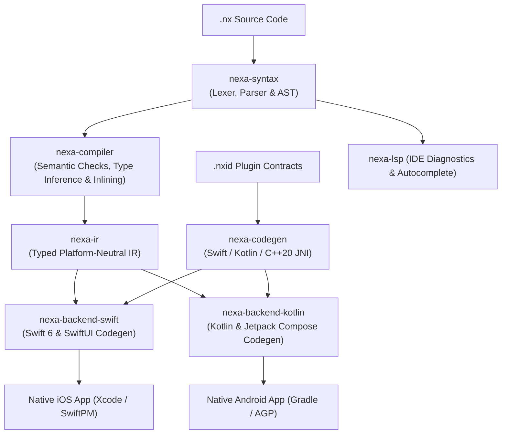

# Nexa ⚡

**The Ahead-Of-Time (AOT) Native Mobile Framework**  
Compiles declarative `.nx` apps directly into 100% native **Swift (SwiftUI)** for iOS and **Kotlin (Jetpack Compose)** for Android.

[](LICENSE)
[](https://www.rust-lang.org)
[](https://swift.org)
[](https://kotlinlang.org)
[]()

---

## Why Nexa?

Nexa eliminates the performance and architectural compromises of legacy cross-platform tools. There is **no bundled JavaScript engine**, **no custom canvas renderer**, and **zero runtime reflection**.

| Architectural Dimension | React Native | Flutter | Kotlin Multiplatform | Nexa ⚡ |
|---|---|---|---|---|
| **UI Rendering Engine** | JS Bridge / Fabric | Impeller (C++ Canvas) | Compose Multiplatform | **100% Native SwiftUI & Jetpack Compose** |
| **Runtime Engine Footprint** | Bundled Hermes / V8 (~15 MB) | Bundled Flutter Engine (~10 MB) | Bundled JVM / Native Runtime | **Zero Overhead (Direct OS Frameworks)** |
| **UI Type Erasure** | N/A (Dynamic JS) | Skia / Impeller Objects | Composable State Boxing | **Zero `AnyView` / Primitive Unboxed States** |
| **Hot Reload & Dev DX** | Fast Refresh (JS only) | Hot Reload (Dart VM) | Experimental | **State-Preserving DevRuntime Hot Reload** |
| **Native Plugin Bridge** | JNI / TurboModules | MethodChannels / FFI | Expect/Actual / C-Interop | **Statically-Typed `.nxid` (Swift, Kotlin, C++20)** |
| **Reactive Database** | Community Async Bridges | SQLite FFI Wrappers | SQLDelight / Room3 | **Optional SQLite plugin with typed `Signal<T>` queries** |

---

## Architecture Pipeline


```mermaid
graph TD
    NX[".nx Source Code"] --> Syntax["nexa-syntax\n(Lexer, Parser & AST)"]
    Syntax --> Compiler["nexa-compiler\n(Semantic Checks, Type Inference & Inlining)"]
    Compiler --> IR["nexa-ir\n(Typed Platform-Neutral IR)"]
    IR --> SwiftBackend["nexa-backend-swift\n(Swift 6 & SwiftUI Codegen)"]
    IR --> KotlinBackend["nexa-backend-kotlin\n(Kotlin & Jetpack Compose Codegen)"]
    PluginIDL[".nxid Plugin Contracts"] --> Codegen["nexa-codegen\n(Swift / Kotlin / C++20 JNI)"]
    Codegen --> SwiftBackend
    Codegen --> KotlinBackend
    SwiftBackend --> iOSBuild["Native iOS App (Xcode / SwiftPM)"]
    KotlinBackend --> AndroidBuild["Native Android App (Gradle / AGP)"]
    Syntax --> LSP["nexa-lsp (IDE Diagnostics & Autocomplete)"]
```

---

## 10-Second Quick Start

### 1. Installation

```bash
git clone --recurse-submodules https://github.com/pigeonmal/nexa.git
cd nexa
cargo build --release -p nexa-cli
sudo cp target/release/nexa /usr/local/bin/
```

### 2. Create & Launch an App

```bash
nexa create TaskFlow
cd TaskFlow
nexa dev
```

### CLI Command Reference

| Command | Syntax | Description |
|---|---|---|
| **Create Project** | `nexa create <name>` | Scaffolds a production-ready `.nx` app with Android & iOS templates. |
| **Type Check** | `nexa check` | Blazing-fast whole-project verification without launching native compilers. |
| **Live Development** | `nexa dev [--ios \| --android]` | Boots simulator/emulator with live DevRuntime hot reload. |
| **Run Tests** | `nexa test [--unit-only]` | Executes all in-language `.nx` `test` blocks and native test runners. |
| **Release Build** | `nexa build --release` | Emits signed Android AABs and iOS production IPA archives. |
| **Health Check** | `nexa doctor` | Verifies local Xcode, Android SDK, Rust, and Clang toolchains. |
| **Plugin Authoring**| `nexa plugin new\|check\|generate` | Scaffolds, validates, and generates local plugin contracts. There is no registry install command. |

### Hot Reload Interactive Keys

When running `nexa dev`:
- `r` — Instantly reloads layout, functions, custom components, and styles.
- `Shift+R` — Hot restart (resets in-memory app state and reloads).
- `b` — Triggers a full native background rebuild and relaunch.

---

## Example: Task Board

This app keeps tasks in typed state, adds a task from a text field, filters completed rows, and updates a task immutably. Layout and text styling are component arguments in Nexa source.

```nexa
struct TaskItem {
    id: Int32,
    title: String,
    priority: String,
    isCompleted: Bool,
    dueLabel: String,
}

app TaskManager {
    state tasks: Array<TaskItem> = [
        TaskItem(1, "Review the release checklist", "High", false, "Today"),
        TaskItem(2, "Send design feedback", "Normal", true, "Yesterday")
    ]
    state showCompleted: Bool = false
    state draftTitle: String = ""

    body {
        Column(spacing: 16, padding: 16) {
            Text("Team tasks", fontSize: 26, fontWeight: Bold)
            Row(spacing: 8) {
                TextInput(value: draftTitle, placeholder: "Add a task")
                Button("Add task", icon: "add", disabled: draftTitle == "") {
                    if draftTitle != "" {
                        tasks.append(TaskItem(tasks.count + 1, draftTitle, "Normal", false, "Today"))
                        draftTitle = ""
                    }
                }
            }
            Switch(value: showCompleted, label: "Show completed tasks")
            if tasks.isEmpty {
                ContentUnavailable(title: "No tasks yet", icon: "checklist", description: "Add a task to start your list.")
            } else {
                FastList(tasks.filter { task -> showCompleted || !task.isCompleted }, key: .id) { task, index in
                    Row(spacing: 12, padding: 12, background: "#F1F5F9", cornerRadius: 10) {
                        Button(task.isCompleted ? "Reopen" : "Complete", style: Plain) {
                            tasks = tasks.map { current ->
                                if current.id == task.id {
                                    TaskItem(current.id, current.title, current.priority, !current.isCompleted, current.dueLabel)
                                } else {
                                    current
                                }
                            }
                        }
                        Column(spacing: 4) {
                            Text("\(index + 1). \(task.title)", fontWeight: Semibold)
                            Text(task.dueLabel, fontSize: 13, color: "#64748B")
                        }
                        Spacer()
                        Row(padding: 6, background: "#E2E8F0", cornerRadius: 6) {
                            Text(task.priority, fontSize: 12, fontWeight: Semibold, color: "#334155")
                        }
                    }
                }
            }
        }
    }
}
```

For exact component parameters and event modifiers, see the [component guide](docs/components.md) and compiler-generated [syntax audit](docs/syntax-audit.md).

---

## Core Framework Guides

| Guide | Description | Key Topics |
|---|---|---|
| 🚀 [**Getting Started**](docs/getting-started.md) | Setup, scaffolding, and CLI workflow | Toolchains, `nexa.config.nx`, targets, flavors |
| 📖 [**Language Guide**](docs/language-guide.md) | Full language specification | Types, `Result<T, E>`, collections, async/await |
| 🧩 [**Component Catalog**](docs/components.md) | Complete 100% UI Reference | All 45 components, parameter tables, modifiers |
| 🧭 [**State & Navigation**](docs/state-and-navigation.md) | Navigation and reactivity | `NavigationStack`, `AppBottomBar`, `Signal<T>` |
| 🔌 [**Native Plugins**](docs/plugins.md) | Native platform extension architecture | `.nxid` IDL, Swift, Kotlin, C++20 JNI |
| 📱 [**Native Widgets**](docs/widgets.md) | iOS WidgetKit and Android Glance | Timelines, refresh policies, shared storage |
| 🎨 [**System Icons**](docs/system-icons.md) | Unified cross-platform icon catalog | SF Symbols and Material Symbols mapping |
| 🏗️ [**Architecture & Performance**](docs/architecture.md) | Compiler internals & benchmarks | Unboxed primitives, memory safety, codegen |

---

## Official Native Plugins

Nexa maintains a first-party native plugin ecosystem under [`plugins/`](https://github.com/pigeonmal/nexa-plugins):

> The table below is generated from each package's `plugin.config.nx`. Do not edit it by hand;
> run `cargo test -p nexa-cli --test plugin_reference` with `NEXA_UPDATE_SNAPSHOTS=1` to
> regenerate. Platform floors come from the manifests, so they cannot disagree with what the
> plugin generator actually emits.

<!-- nexadoc:begin plugin-index -->
| Plugin | Package ID | Key Capabilities | Supported Platforms |
|---|---|---|---|
| **Audio Player** | `dev.nexa.audio-player` | Background audio streaming, lock screen playback controls | iOS 17.0+ \| Android 26+ |
| **Biometrics** | `dev.nexa.biometrics` | Face ID, Touch ID, and Android BiometricPrompt | iOS 13.0+ \| Android 28+ |
| **Browser** | `dev.nexa.browser` | In-app Safari and Chrome Custom Tabs for OAuth flows | iOS 16.0+ \| Android 23+ |
| **Camera** | `dev.nexa.camera` | Native camera preview, photo capture, video recording | iOS 17.0+ \| Android 23+ |
| **Data Extractor** | `dev.nexa.data-extractor` | On-device Vision OCR, barcode scanning, text recognition | iOS 13.0+ \| Android 28+ |
| **In-App Purchases** | `dev.nexa.in-app-purchases` | StoreKit 2 and Google Play Billing subscriptions | iOS 17.0+ \| Android 23+ |
| **Mail Composer** | `dev.nexa.mail-composer` | Native email composition sheets with attachments | iOS 16.0+ \| Android 23+ |
| **Maps** | `dev.nexa.maps` | Interactive MapKit and Google Maps views with pins | iOS 17.0+ \| Android 23+ |
| **Media Picker** | `dev.nexa.media-picker` | System photo and video picker without privacy permissions | iOS 16.0+ \| Android 23+ |
| **MMKV** | `dev.nexa.mmkv` | High-speed memory-mapped key-value storage | iOS 13.0+ \| Android 21+ |
| **Notifications** | `dev.nexa.notifications` | Scheduled local notifications, badge counts, actions | iOS 13.0+ \| Android 23+ |
| **Sensors** | `dev.nexa.sensors` | Accelerometer, gyroscope, and magnetometer telemetry | iOS 17.0+ \| Android 26+ |
| **SQLite** | `dev.nexa.sqlite` | Reactive `observeQuery<T>`, WAL mode, cross-process sync | iOS 13.0+ \| Android 23+ |
| **Video Player** | `dev.nexa.video-player` | Hardware-accelerated HLS and MP4 video playback | iOS 17.0+ \| Android 23+ |
| **Websocket** | `dev.nexa.websocket` | Low-latency binary and text WebSockets with auto-reconnect | iOS 13.0+ \| Android 21+ |
| **Webview** | `dev.nexa.webview` | In-app browser engine with two-way JavaScript bridge | iOS 17.0+ \| Android 24+ |
<!-- nexadoc:end plugin-index -->

---

## Workspace Verification

To build and verify the compiler suite locally:

```bash
export CARGO_TARGET_DIR=/tmp/nexa-verification-target

# 1. Type checking across all 15 crates
cargo check --workspace --all-targets

# 2. Strict linter verification
cargo clippy --workspace --all-targets

# 3. Complete test suite
cargo test --workspace
```

---

## License

Nexa is open-source software licensed under the **Mozilla Public License 2.0 (MPL-2.0)**. See [LICENSE](LICENSE) for details.
