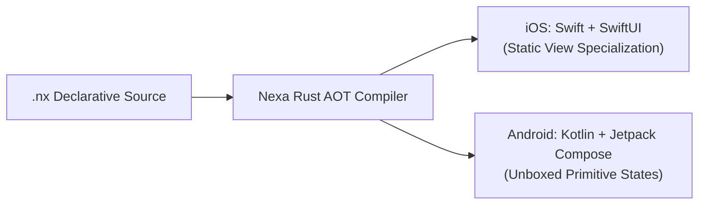

# Nexa Documentation Hub 📚

[]()
[](../LICENSE)

Welcome to the definitive engineering documentation for **Nexa**, the Ahead-Of-Time (AOT) mobile transpiler targeting native **Swift (SwiftUI)** for iOS and **Kotlin (Jetpack Compose)** for Android.

## Quick start

Save this as `App.nx` in a Nexa project, then run `nexa check`:

```nx
app ReadingQueue {
    state booksRead: Int32 = 4

    body {
        Column(spacing: 12, padding: 16) {
            Text("Books read: \(booksRead)", fontSize: 22, fontWeight: Bold)
            Button("Finish a book") {
                booksRead = booksRead + 1
            }
        }
    }
}
```

---

## Documentation Directory

| Section | Guide | Target Audience | Core Topics |
|---|---|---|---|
| **Quickstart** | 🚀 [**Getting Started**](getting-started.md) | Beginners & App Developers | Installation, CLI commands, project structure, `nexa.config.nx`, first app |
| **Language** | 📖 [**Language Guide**](language-guide.md) | All Developers | Types, collections, functions, async/await, `Result<T, E>`, and in-language tests |
| **UI System** | 🧩 [**Component Guide**](components.md) | UI & UX Engineers | Native component composition patterns and styling |
| **UI Grammar** | 🧾 [**Syntax Audit**](syntax-audit.md) | App and framework authors | Compiler-generated inventory of accepted components, options, child blocks, and modifiers |
| **Navigation** | 🧭 [**State & Navigation**](state-and-navigation.md) | Application Architects | State scopes, `NavigationStack`, `AppBottomBar`, `NavigationSplitView`, `Signal<T>` |
| **Plugins** | 🔌 [**Native Plugins Guide**](plugins.md) | Systems & Plugin Authors | Local plugin workflow, `.nxid` contracts, native targets, manifest, and analyzer hooks |
| **Widgets** | 📱 [**Native Widgets Reference**](widgets.md) | Mobile Developers | iOS WidgetKit, Android Glance/RemoteViews, timelines, shared App Group storage |
| **Design** | 🎨 [**System Icons Catalog**](system-icons.md) | Designers & Developers | Cross-platform icon catalog: Apple SF Symbols & Google Material Symbols |
| **Internals** | 🏗️ [**Architecture & Performance**](architecture.md) | Compiler & Systems Engineers | AOT pipeline, IR transformation, unboxed state, zero-overhead layout flattening |

---

## Core Engineering Invariants



1. **Zero Runtime Engine or Dynamic Interpreter**:
   Generated applications link directly against platform SDKs (`UIKit`/`SwiftUI` and `AndroidX`/`Jetpack Compose`). There is no bundled V8, Hermes, or Dart VM.
2. **Zero `AnyView` or State Boxing**:
   - In Swift: Virtualized lists (`FastList`) compile into specialized generic views with zero type erasure.
   - In Kotlin: Primitive state types compile into unboxed specialized holders (`mutableIntStateOf`, `mutableDoubleStateOf`).
3. **Deterministic & Idempotent Builds**:
   All scaffolding templates and generated native codebases are 100% deterministic, reproducible, and verifiable.
4. **Strongly-Typed Cross-Platform Plugins**:
   Platform extensions use `.nxid` contracts to generate typed Swift and Kotlin bindings. C++ adapters are available for supported API shapes.

---

## Need Help?

- **Official Plugins Directory**: Check out [`plugins/`](../plugins/README.md) for camera, maps, biometrics, SQLite, audio/video players, and push notifications.
- **Example Applications**: Review production-grade sample applications in [`examples/`](../examples/).
