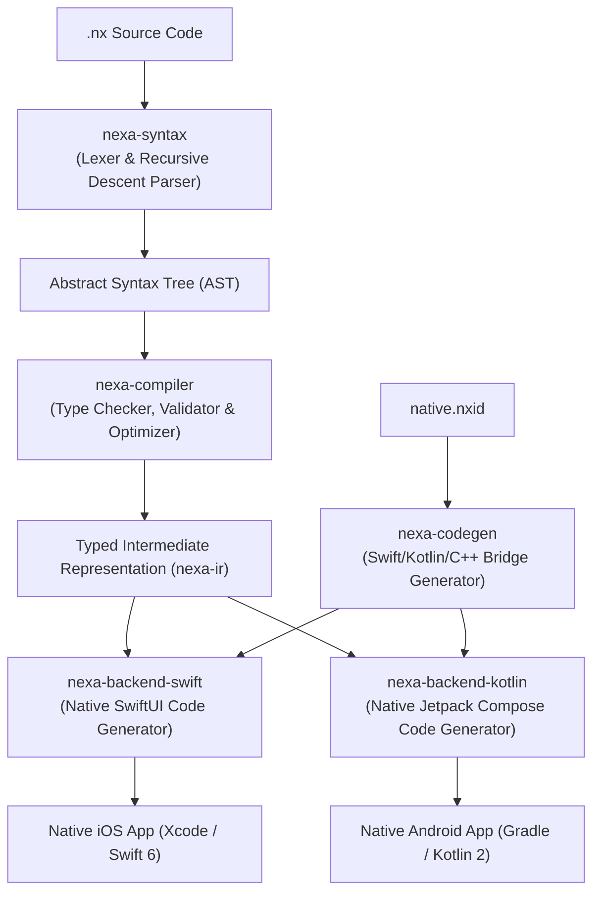

# Nexa Architecture & Performance Model

Nexa is engineered around a core tenet: **generated native code must match or outperform hand-written native code**.

---

## 1. Compilation Pipeline



---

## 2. Zero-Cost Performance Invariants

### 1. Zero Runtime Reflection or Dynamic Boxing
Unlike cross-platform engines that use untyped hash maps or reflection (`Any`, `Object`, `Mirror`), Nexa statically types all variables, expressions, and parameters directly into concrete Swift and Kotlin types.

### 2. Elimination of `AnyView` in SwiftUI
Type-erased views (`AnyView`) destroy SwiftUI's structural identity tree and induce per-frame heap allocations during scrolling. Nexa emits specialized generic view hierarchies:
```swift
// Emitted by Nexa:
VStack(spacing: 16) {
    Text(count.description)
}
// NOT: AnyView(VStack { ... })
```

### 3. Unboxed Compose State in Kotlin
In Jetpack Compose, generic `mutableStateOf<Double>` causes continuous autoboxing and garbage collection pressure. Nexa emits primitive-specialized states:
```kotlin
// Emitted by Nexa:
val count = remember { mutableIntStateOf(0) }
val progress = remember { mutableDoubleStateOf(0.0) }
```

### 4. Zero-Copy C++ Bridging
C++ native plugins communicate directly via pointer views and standard C++ primitives (`std::int32_t`, `std::vector<std::uint8_t>`) without serialization overhead.
