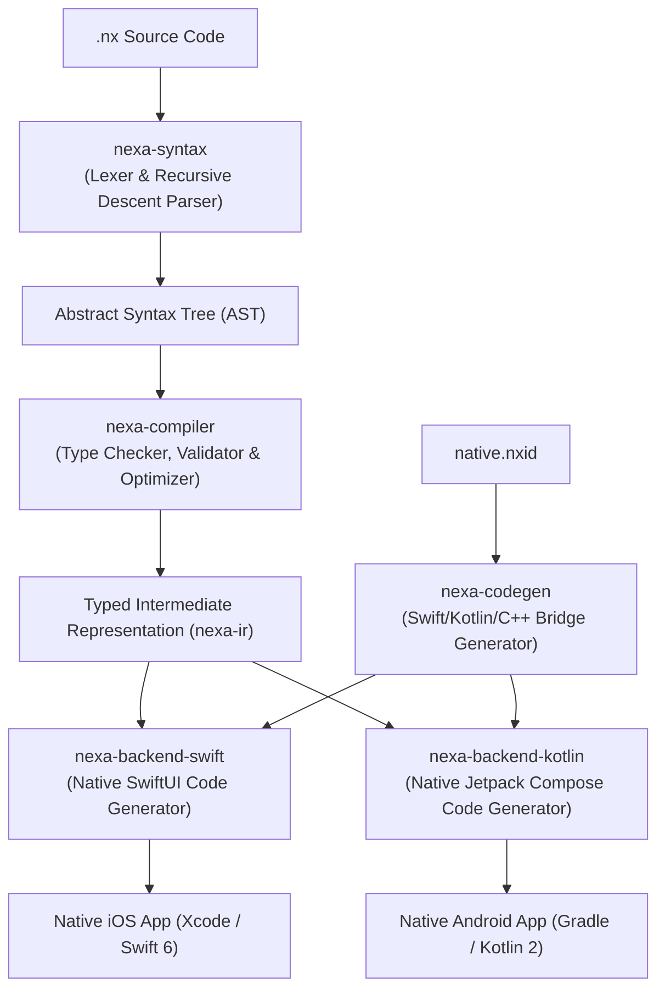
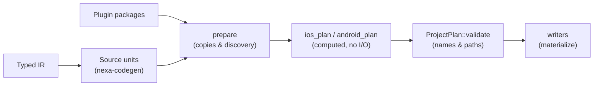

# Nexa Architecture & Performance Model

Nexa is engineered around a core tenet: **generated native code must match or outperform hand-written native code**.

---

## 1. Compilation Pipeline



---

## 2. Performance Characteristics

### 1. Zero Runtime Reflection or Dynamic Boxing
Unlike cross-platform engines that use untyped hash maps or reflection (`Any`, `Object`, `Mirror`), Nexa statically types all variables, expressions, and parameters directly into concrete Swift and Kotlin types.

### 2. Elimination of `AnyView` in SwiftUI
Type-erased views such as `AnyView` hide a view's concrete structure from SwiftUI. Nexa's generated view hierarchy uses concrete view types and does not emit `AnyView` wrappers:
```swift
// Emitted by Nexa:
VStack(spacing: 16) {
    Text(count.description)
}
// NOT: AnyView(VStack { ... })
```

### 3. Unboxed Compose State in Kotlin
In Jetpack Compose, generic state holders represent numeric values as boxed values. Nexa selects primitive-specialized state holders for supported numeric types:
```kotlin
// Emitted by Nexa:
val count = remember { mutableIntStateOf(0) }
val progress = remember { mutableDoubleStateOf(0.0) }
```

### 4. Typed C++ Bridging
C++ native plugins use generated bindings and standard C++ types such as `std::int32_t` and `std::vector<std::uint8_t>`. The bindings avoid a serialization format, while converting collection values at language boundaries may copy their contents.

## 3. Generated Source Cache

The CLI fingerprints the source graph and a generator schema version before reusing generated native output. The schema is advanced when compiler or backend behavior changes without a source edit, so cached projects cannot retain stale generated code. `build-v92` includes the development host's first-party File and Path helpers required when those APIs are added by hot reload.

## 4. Host Project Generation

Generating a native host project is split into three stages so that *what* gets
generated can be inspected and tested without writing a project.



- **Units.** The backends emit named compile units, each carrying its own file
  name and body, rather than one string with marker comments. Assembling those
  bodies into files is a separate, explicit step, because a host project has to
  adjust the header first: plugin bindings add imports every file must see, and
  Kotlin needs a `package` line ahead of them.
- **Prepare.** The filesystem work whose results the Xcode project and Gradle
  scripts must reference: staging plugin sources, vendoring artifacts, copying
  images.
- **Plan.** Every path, name, and file body, computed from prepared facts with
  no filesystem access. Plans carry text files, binary files such as the Gradle
  wrapper jar, executable bits, and `CopyAction`s for artifacts vendored from a
  plugin package -- all as data.

Staging a plugin artifact follows the same split. `stage_ios_plugin_artifacts`
validates each XCFramework and returns the name the Xcode project references
plus a `CopyAction`; the plan turns the difference against the staging marker
into removals and writes the marker as an ordinary planned file. Only the
writer copies or deletes.
- **Validate.** One place decides whether names and paths are sound: duplicate
  unit names, a unit name that is really a path, a planned file colliding with a
  compile unit, a path escaping the project root, or a plan that both writes and
  removes the same file.
- **Write.** Content-addressed writes, so a rebuild does not churn timestamps or
  re-trigger downstream incremental builds.

Correctness is enforced by three byte-identity harnesses that render real output
and print a digest per artifact: `app_fingerprint` (generated Swift and Kotlin),
`bridge_fingerprint` (the plugin C++/Swift/JNI bridge), and
`project_fingerprint` (every file a generated host project contains).
