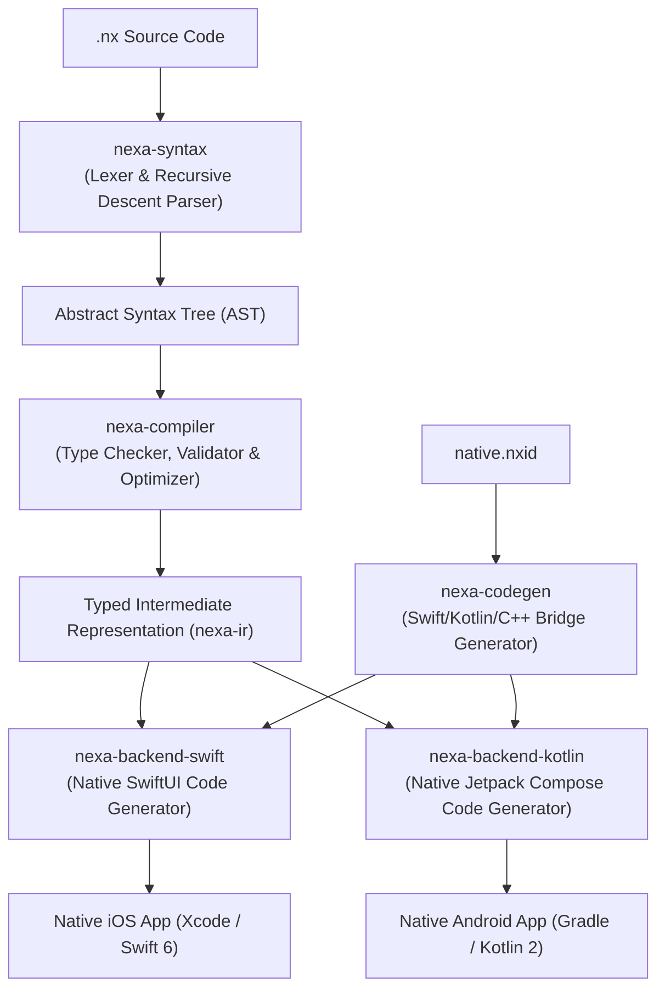

# Nexa Architecture & Performance Model

Nexa is engineered around a core tenet: **generated native code must match or outperform hand-written native code**.

---

## 1. Compilation Pipeline



---

## 2. Performance Characteristics

### 1. Zero Runtime Reflection or Dynamic Boxing
Unlike cross-platform engines that use untyped hash maps or reflection (`Any`, `Object`, `Mirror`), Nexa statically types all variables, expressions, and parameters directly into concrete Swift and Kotlin types.

### 2. Elimination of `AnyView` in SwiftUI
Type-erased views such as `AnyView` hide a view's concrete structure from SwiftUI. Nexa's generated view hierarchy uses concrete view types and does not emit `AnyView` wrappers:
```swift
// Emitted by Nexa:
VStack(spacing: 16) {
    Text(count.description)
}
// NOT: AnyView(VStack { ... })
```

### 3. Unboxed Compose State in Kotlin
In Jetpack Compose, generic state holders represent numeric values as boxed values. Nexa selects primitive-specialized state holders for supported numeric types:
```kotlin
// Emitted by Nexa:
val count = remember { mutableIntStateOf(0) }
val progress = remember { mutableDoubleStateOf(0.0) }
```

### 4. Typed C++ Bridging
C++ native plugins use generated bindings and standard C++ types such as `std::int32_t` and `std::vector<std::uint8_t>`. The bindings avoid a serialization format, while converting collection values at language boundaries may copy their contents.

## 3. Generated Source Cache

The CLI fingerprints the source graph and a generator schema version before reusing generated native output. The schema is advanced when compiler or backend behavior changes without a source edit, so cached projects cannot retain stale generated code. `build-v92` includes the development host's first-party File and Path helpers required when those APIs are added by hot reload.
