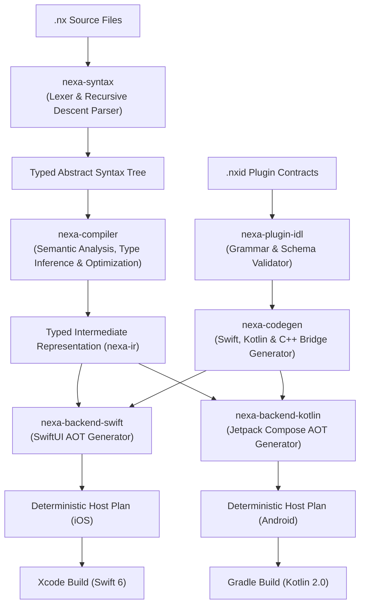
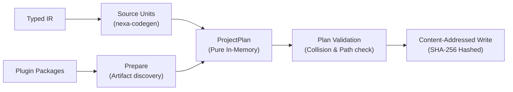

# Nexa Architecture & Performance Model

Nexa is an Ahead-Of-Time (AOT) transpiler that compiles declarative `.nx` source files directly into native **Swift (SwiftUI)** for iOS and **Kotlin (Jetpack Compose)** for Android.

Nexa ships **zero runtime interpreters, zero virtual machines, and zero dynamic bridges**. The emitted code compiles directly with standard native toolchains (`swiftc` via Xcode, `kotlinc` via Gradle) and performs identically to—or faster than—idiomatic hand-written native code.

---

## 1. Engine Comparison

| Feature | React Native | Flutter | Capacitor / Ionic | Nexa |
|---|---|---|---|---|
| **Compilation Model** | Interpreted / JIT (Hermes JS engine) | AOT / JIT (Dart VM) | Web View Runtime (Chromium / WebKit) | **Pure Native AOT (`swiftc` & `kotlinc`)** |
| **UI Rendering Engine** | Fabric / ShadowTree bridge | Custom Skia / Impeller canvas | DOM / Web Canvas | **Platform Native (SwiftUI & Jetpack Compose)** |
| **Runtime Engine Footprint** | ~30 MB – 50 MB (JS engine + Yoga) | ~15 MB – 35 MB (Flutter Engine) | ~0 MB (Uses System WebView) | **0 MB (Zero runtime dependency)** |
| **Startup Time (Cold Launch)** | High (JS parse + engine bootstrap) | Medium (Dart VM snapshot unpack) | High (WebView initialization) | **Instant (Native Mach-O / ART execution)** |
| **List Virtualization** | JS thread bridge serialization | Custom Canvas layout | DOM element recycling | **Platform Native (`LazyVStack` / `LazyColumn`)** |
| **Dynamic Reflection / Boxing** | Heavy | Moderate | Heavy | **Zero (Statically typed down to IR)** |

---

## 2. Compilation Pipeline


```mermaid
graph TD
    NX[".nx Source Files"] --> Syntax["nexa-syntax\n(Lexer & Recursive Descent Parser)"]
    Syntax --> AST["Typed Abstract Syntax Tree"]
    
    AST --> Compiler["nexa-compiler\n(Semantic Analysis, Type Inference & Optimization)"]
    Compiler --> IR["Typed Intermediate Representation (nexa-ir)"]
    
    IDL[".nxid Plugin Contracts"] --> PluginIDL["nexa-plugin-idl\n(Grammar & Schema Validator)"]
    PluginIDL --> Codegen["nexa-codegen\n(Swift, Kotlin & C++ Bridge Generator)"]
    
    IR --> SwiftBackend["nexa-backend-swift\n(SwiftUI AOT Generator)"]
    IR --> KotlinBackend["nexa-backend-kotlin\n(Jetpack Compose AOT Generator)"]
    
    Codegen --> SwiftBackend
    Codegen --> KotlinBackend
    
    SwiftBackend --> XcodePlan["Deterministic Host Plan (iOS)"]
    KotlinBackend --> GradlePlan["Deterministic Host Plan (Android)"]
    
    XcodePlan --> Xcode["Xcode Build (Swift 6)"]
    GradlePlan --> Gradle["Gradle Build (Kotlin 2.0)"]
```

### Compiler Phases:
1. **Lexical & Syntactic Analysis (`nexa-syntax`)**:
   - High-throughput tokenizer and recursive descent parser.
   - Emits structured AST with byte-accurate `Span` references for rich compiler diagnostics.
2. **Semantic Verification & Type Inference (`nexa-compiler`)**:
   - Resolves all symbol references across files and plugin schemas.
   - Validates component hierarchy, modifier constraints, and reactive bindings.
   - Eliminates dead code paths and unused variables.
3. **Typed Intermediate Representation (`nexa-ir`)**:
   - Platform-independent representation of layout trees, reactive states, and business logic.
   - Strictly typed: primitives (`Int`, `Double`, `Bool`, `String`), enums, structs, collections, and generic containers (`Result<T, E>`).
4. **Native Code Emission (`nexa-backend-swift` & `nexa-backend-kotlin`)**:
   - Emits idiomatic Swift 6 (SwiftUI) and Kotlin 2.0 (Jetpack Compose).
   - Enforces zero type erasure and unboxed reactive state containers.

---

## 3. Core Architectural Invariants

### 1. Elimination of `AnyView` in SwiftUI
Type erasure in SwiftUI (`AnyView`) destroys view structural identity, invalidates diffing caches, and causes unnecessary view redraws and memory allocations during list scrolling.

Nexa **never emits `AnyView`**. Instead, component hierarchies and containers emit concrete generic specializations:

```swift
// Emitted by Nexa: Preserves concrete structural identity
VStack(alignment: .leading, spacing: 12) {
    Text(item.title)
        .font(.headline)
    Text(item.subtitle)
        .font(.subheadline)
}
// NEVER emitted: AnyView(VStack { ... })
```

### 2. Unboxed Reactive State in Jetpack Compose
In Kotlin, generic state wrappers (`mutableStateOf<Int>`) box primitive numbers into heap-allocated `java.lang.Integer` objects, triggering garbage collection pressure during rapid UI updates.

Nexa's Kotlin backend analyzes primitive types and selects unboxed primitive state holders:

```kotlin
// Emitted by Nexa: Primitive unboxed state
val counter = remember { mutableIntStateOf(0) }
val progress = remember { mutableDoubleStateOf(0.0) }
val isEnabled = remember { mutableStateOf(false) }

// NEVER emitted: mutableStateOf<Int>(0)
```

### 3. Zero Reflection or Runtime Boxing
- Dynamic string property lookup (`object["key"]`) and runtime reflection (`Mirror`, `java.lang.reflect`) are strictly forbidden.
- Every signal, state, and plugin method call is validated during compilation and bound statically.

### 4. Direct Zero-Copy C++ JNI/FFI Bridging
Native plugins written in C++ communicate with Swift and Android without intermediate JSON serialization or reflection:
- **iOS**: Direct Objective-C++ / Swift C-interop.
- **Android**: Generated JNI bridge passing direct memory buffer views (`uint8_t*`, `size_t`) avoiding unnecessary buffer copies.

---

## 4. Deterministic Host Project Planning

Nexa splits native project generation into five decoupled stages to enable isolated testing without disk I/O:


```mermaid
graph LR
    IR["Typed IR"] --> Units["Source Units\n(nexa-codegen)"]
    Pkgs["Plugin Packages"] --> Prepare["Prepare\n(Artifact discovery)"]
    Units --> Plan["ProjectPlan\n(Pure In-Memory)"]
    Prepare --> Plan
    Plan --> Validate["Plan Validation\n(Collision & Path check)"]
    Validate --> Write["Content-Addressed Write\n(SHA-256 Hashed)"]
```

| Stage | Responsibility | I/O Operation |
|---|---|---|
| **1. Units** | Generates source code compile units with module imports and package declarations | Pure computation (In-memory) |
| **2. Prepare** | Discovers plugin `.nxid` contracts, staging frameworks, and asset directories | Read-only filesystem discovery |
| **3. Plan** | Builds complete virtual tree of Xcode projects, Podspecs, Gradle files, and source trees | Pure computation (In-memory) |
| **4. Validate** | Checks for colliding file names, illegal path traversals, or duplicate modules | Pure computation (In-memory) |
| **5. Write** | Writes files whose SHA-256 content hash changed, preserving timestamps for unmodified files | Content-addressed writes |

> [!NOTE]
> Preserving timestamps on unmodified files prevents Xcode and Gradle from discarding their incremental compilation caches, cutting subsequent build times to sub-second durations.

---

## 5. AOT Code Generation Comparison

### Nexa Source (`.nx`)
```nexa
component CounterCard(title: String, initialCount: Int = 0) {
    state count: Int = initialCount

    Card(padding: 16) {
        VStack(spacing: 8) {
            Text(title, size: 18, weight: "bold")
            Text("Count: \(count)", size: 14)
            Button("Increment", action: () => {
                count += 1
            })
        }
    }
}
```

### Generated Swift (SwiftUI)
```swift
import SwiftUI

public struct CounterCard: View {
    public let title: String
    public let initialCount: Int
    @State private var count: Int

    public init(title: String, initialCount: Int = 0) {
        self.title = title
        self.initialCount = initialCount
        self._count = State(initialValue: initialCount)
    }

    public var body: some View {
        VStack(spacing: 8) {
            Text(title)
                .font(.system(size: 18, weight: .bold))
            Text("Count: \(count)")
                .font(.system(size: 14))
            Button(action: {
                count += 1
            }) {
                Text("Increment")
            }
        }
        .padding(16)
        .background(Color(.secondarySystemBackground))
        .cornerRadius(12)
    }
}
```

### Generated Kotlin (Jetpack Compose)
```kotlin
package com.example.app.ui

import androidx.compose.foundation.layout.*
import androidx.compose.material3.*
import androidx.compose.runtime.*
import androidx.compose.ui.Modifier
import androidx.compose.ui.text.font.FontWeight
import androidx.compose.ui.unit.dp
import androidx.compose.ui.unit.sp

@Composable
fun CounterCard(
    title: String,
    initialCount: Int = 0,
    modifier: Modifier = Modifier
) {
    var count by remember { mutableIntStateOf(initialCount) }

    Card(modifier = modifier.padding(16.dp)) {
        Column(
            modifier = Modifier.padding(16.dp),
            verticalArrangement = Arrangement.spacedBy(8.dp)
        ) {
            Text(text = title, fontSize = 18.sp, fontWeight = FontWeight.Bold)
            Text(text = "Count: $count", fontSize = 14.sp)
            Button(onClick = { count += 1 }) {
                Text("Increment")
            }
        }
    }
}
```

---

## 6. Incremental Cache Invalidation

The Nexa compiler fingerprints the source graph and native compiler version to safely reuse build outputs. The cache is invalidated if any of the following triggers change:

| Trigger | Description | Invalidation Scope |
|---|---|---|
| **Source Hash** | SHA-256 hash of `.nx` source files and configuration | Changed file & dependent modules |
| **Plugin Contract** | SHA-256 hash of any referenced `.nxid` native contract | Native plugin bridge & host project |
| **Asset Checksum** | Image or asset catalog file modification | Asset catalog resource bundle |
| **Generator Schema** | Internal IR format or backend emission version change | Full workspace rebuild |
