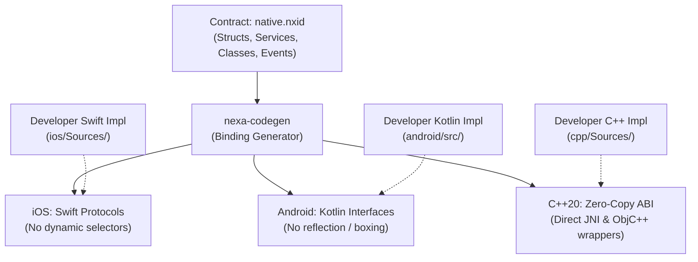

# Native Plugin Architecture & IDL Guide 🔌

Nexa provides a strongly typed, zero-overhead native plugin system. Plugins define declarative contracts in `.nxid` Interface Definition Language (IDL), and the compiler automatically generates type-safe native bindings for **Swift (iOS)**, **Kotlin (Android)**, and **C++20 (Cross-Platform Native)**.

---

## 1. Plugin Architecture Overview



### Directory Structure of a Plugin Package

```text
my-plugin/
├── native.nxid           # Authoritative IDL interface contract
├── plugin.config.nx      # Plugin metadata, SDK floors, and source globs
├── cpp/                  # Optional C++20 cross-platform implementation
│   ├── include/
│   └── Sources/
├── ios/                  # Swift implementation
│   └── Sources/
└── android/              # Kotlin implementation
    └── src/main/kotlin/
```

---

## 2. Interface Definition Language (`.nxid`)

The `.nxid` file is the contract between the `.nx` compiler and platform implementations.

### 2.1 Structs, Enums, and Errors

```nxid
struct GeoCoordinate {
    latitude: Float64
    longitude: Float64
    altitude: Float64?
}

enum AccuracyMode {
    coarse
    fine
    bestForNavigation
}

error LocationFailure {
    permissionDenied
    serviceDisabled
    timeout(seconds: Float64)
}
```

### 2.2 Singleton Services (`service`)

Stateless or globally shared singleton APIs:

```nxid
service Geolocation {
    fn isLocationAvailable() -> Bool
    async fn getCurrentPosition(accuracy: AccuracyMode) -> GeoCoordinate throws LocationFailure
}
```

### 2.3 Stateful Classes (`native class`)

Native objects with lifecycle identity, constructor parameters, properties, and event streams:

```nxid
native class LocationTracker {
    init(updateIntervalMs: Int32)

    val isTracking: Bool
    val lastKnownLocation: GeoCoordinate?

    fn start() throws LocationFailure
    fn stop()
    fn dispose()

    event locationUpdated(location: GeoCoordinate)
    event errorOccurred(error: LocationFailure)
}
```

### 2.4 Native UI Views (`native component`)

Exposes a platform-native view (such as an Apple `MKMapView` or Android `GoogleMap`) directly to `.nx` declarative view hierarchies:

```nxid
native component MapView {
    center: GeoCoordinate
    zoomLevel: Float64
    showsUserLocation: Bool = true

    event regionChanged(newCenter: GeoCoordinate)
    event markerTapped(markerId: String)
}
```

### 2.5 Reactive Primitives (`Signal<T>`) & Row Mappings

For reactive data streams (like SQLite queries or sensor feeds):

```nxid
native class Database {
    init(name: String)

    // Maps rows directly into app structs via zero-cost static row mappers
    async fn query<T: Row>(sql: String, parameters: Array<Value>) -> Array<T> throws Failure rowFailure queryFailed

    // Returns a live reactive signal invalidating on table writes
    fn observeQuery<T: Row>(sql: String, parameters: Array<Value>) -> Signal<Array<T>> rowFailure queryFailed
}
```

---

## 3. Plugin Manifest: `plugin.config.nx`

Declares package metadata, platform minimums, and native source directories:

```nexa
plugin {
    schema: 2
    id: "dev.nexa.geolocation"
    version: "1.0.0"

    sources {
        native: "native.nxid"
    }

    ios {
        minVersion: "16.0"
        sources: ["ios/Sources/**/*.swift"]
        frameworks: ["CoreLocation"]
    }

    android {
        minSdk: 23
        sources: ["android/src/main/kotlin/**/*.kt"]
        dependencies: [
            "com.google.android.gms:play-services-location:21.0.1"
        ]
    }

    cpp {
        standard: "c++20"
        includeDirs: ["cpp/include"]
        sources: ["cpp/Sources/**/*.cpp"]
    }
}
```

---

## 4. Platform Implementations

### 4.1 Swift Implementation (`ios/Sources/`)

Generated protocol:
```swift
public protocol NexaGeolocationProtocol {
    func isLocationAvailable() -> Bool
    func getCurrentPosition(accuracy: NexaAccuracyMode) async throws -> NexaGeoCoordinate
}
```

Implementation:
```swift
import Foundation
import CoreLocation

public final class NexaGeolocationImpl: NexaGeolocationProtocol {
    private let manager = CLLocationManager()

    public init() {}

    public func isLocationAvailable() -> Bool {
        return CLLocationManager.locationServicesEnabled()
    }

    public func getCurrentPosition(accuracy: NexaAccuracyMode) async throws -> NexaGeoCoordinate {
        guard isLocationAvailable() else {
            throw NexaLocationFailure.serviceDisabled
        }
        // Native CoreLocation async fetch...
        return NexaGeoCoordinate(latitude: 37.7749, longitude: -122.4194, altitude: nil)
    }
}
```

---

### 4.2 Kotlin Implementation (`android/src/`)

Generated interface:
```kotlin
public interface NexaGeolocationProtocol {
    fun isLocationAvailable(): Boolean
    suspend fun getCurrentPosition(accuracy: NexaAccuracyMode): NexaGeoCoordinate
}
```

Implementation:
```kotlin
package dev.nexa.geolocation

import android.content.Context
import android.location.LocationManager

public class NexaGeolocationImpl(private val context: Context) : NexaGeolocationProtocol {
    override fun isLocationAvailable(): Boolean {
        val manager = context.getSystemService(Context.LOCATION_SERVICE) as LocationManager
        return manager.isProviderEnabled(LocationManager.GPS_PROVIDER)
    }

    override suspend fun getCurrentPosition(accuracy: NexaAccuracyMode): NexaGeoCoordinate {
        if (!isLocationAvailable()) {
            throw NexaLocationFailure.ServiceDisabled()
        }
        return NexaGeoCoordinate(37.7749, -122.4194, null)
    }
}
```

---

### 4.3 C++20 Cross-Platform Engine (`cpp/`)

For performance-critical code (cryptography, physics, audio processing):
- Zero JNI reflection overhead: Nexa generates direct, non-allocating C++ structs and flat buffer readers.
- Shared between iOS (compiled directly with Clang/ObjC++) and Android (compiled via NDK with CMake/Ninja).

```cpp
#include "NexaGeolocation.hpp"

namespace nexa::geolocation {

bool GeolocationImpl::isLocationAvailable() noexcept {
    return true;
}

} // namespace nexa::geolocation
```

---

## 5. Host-Side Compiler Analyzers

Plugins may optionally provide a compile-time analyzer to validate domain-specific logic during `nexa check`:

```nexa
compiler {
    analyzer: ["cargo", "run", "--manifest-path", "compiler/Cargo.toml"]
}
```

### JSON-RPC Protocol (One line per request/response on stdin/stdout)

- **Request**: Nexa compiler passes the parsed AST graph, target OS versions, and source paths.
- **Response**: Analyzer returns source-located diagnostic errors and warnings:

```json
{
  "protocol_version": 1,
  "diagnostics": [
    {
      "severity": "warning",
      "message": "SQLite window functions require iOS 13.0+ or Android 30+",
      "file": "App.nx",
      "start": 142,
      "end": 180,
      "line": 12,
      "column": 5,
      "target": "android"
    }
  ]
}
```

---

## 6. Testing & Verifying Plugins

Validate plugin packages using the dedicated CLI suite:

```bash
# Validates schema consistency, dependencies, and manifest syntax
nexa plugin check

# Generates native scaffolding and binding updates
nexa plugin generate
```
