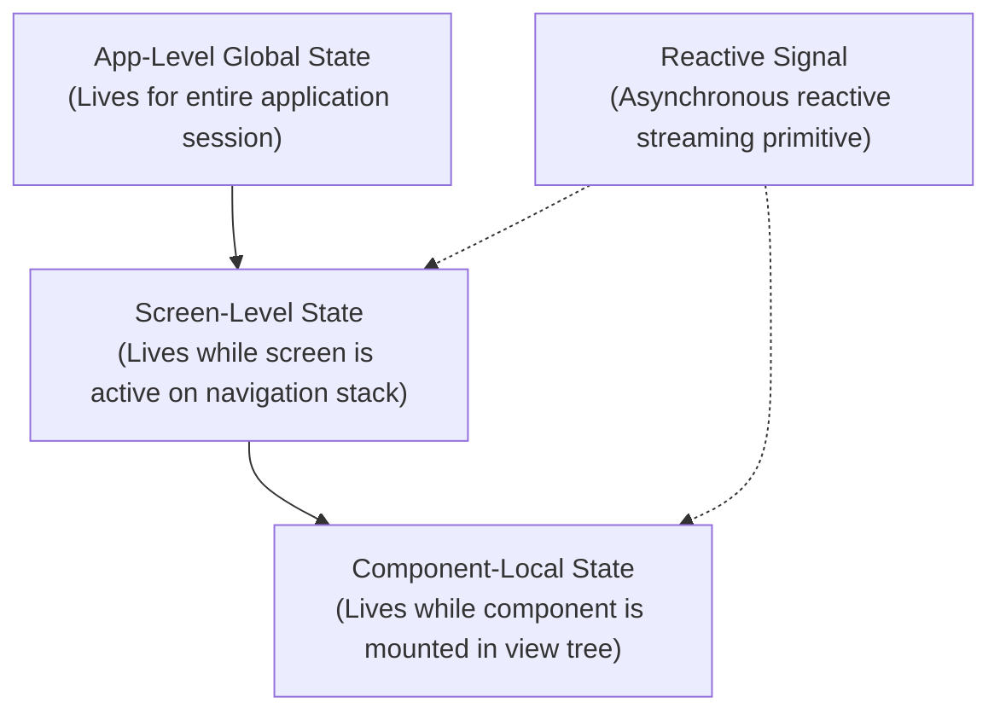

# State & Navigation in Nexa 🧭

Nexa provides a statically verified, reactive state management and navigation model that compiles directly into native **SwiftUI navigation stacks** and **Jetpack Compose destinations**.

---

## 1. Reactive State Scopes

State in Nexa is explicit, strongly typed, and scoped to the exact lifetime of its declaring container:



### State Scoping Comparison

| Scope | Declared In | Lifetime | Recomposition Boundary | Example Use Case |
|---|---|---|---|---|
| **App Global** | `app { state ... }` | Entire application lifecycle | Emits updates across all listening screens | User auth token, cart item count, current theme |
| **Screen Local** | `screen { state ... }` | Preserved on navigation stack | Limited to that screen's view tree | Search queries, form drafts, expanded filters |
| **Component Local**| `component { state ... }`| Disposed when unmounted | Limited to that specific component instance | Accordion open/close, button debounce |
| **Reactive Signal**| `Signal<T>` | Disposed via `.dispose()` / `OnDisappear` | Emits live snapshots to listeners | Reactive SQLite tables, live sensor streams |

---

## 2. Stack Navigation: `NavigationStack`

Multi-screen routing uses `NavigationStack` as the root container, with `NavigationLink` triggering push transitions and native swipe-to-back gestures.

```nexa
struct Product {
    id: Int64,
    title: String,
    price: Float64
}

app StoreApp {
    state cartCount: Int32 = 0

    screen ProductList {
        state products: Array<Product> = [
            Product(1, "Wireless Headphones", 149.99),
            Product(2, "Mechanical Keyboard", 119.00)
        ]

        FastList(products, key: "id") { item in
            NavigationLink(destination: ProductDetail(id: item.id, title: item.title, price: item.price)) {
                Row(spacing: 12, padding: 12) {
                    Text(item.title).fontSize(16).bold()
                    Spacer()
                    Text(Number.formatCurrency(item.price, "USD")).foregroundColor("#38BDF8")
                }
            }
        }
    }

    screen ProductDetail(id: Int64, title: String, price: Float64) {
        Column(spacing: 16, padding: 20) {
            Text(title).fontSize(24).bold()
            Text(Number.formatCurrency(price, "USD")).fontSize(20).foregroundColor("#38BDF8")
            
            Button("Add to Cart", icon: "cart.badge.plus") {
                cartCount = cartCount + 1
            }

            NavigationBack(label: "Back to Products")
        }
    }

    body {
        NavigationStack(root: ProductList)
    }
}
```

### Navigation Primitives Reference

| Primitive | Parameters | Description |
|---|---|---|
| `NavigationStack` | `root: ScreenName` | Top-level host for stack-based navigation. |
| `NavigationLink` | `destination: Screen(args...)` | Tap target navigating to destination screen. |
| `NavigationBack` | `label: String?` | Programmatic back navigation button with optional custom label. |

---

## 3. Deep Linking & URL Routing

Declare custom URL schemes and universal HTTPS domains in `nexa.config.nx`:

```nexa
config {
    app {
        deepLinks: ["storeapp://", "https://store.example.com"]
    }
}
```

### Deep Link Resolution Rules

Routes resolve by matching screen names in lowercase kebab-case, followed by positional path arguments:

| Target Screen Declaration | Incoming Deep Link URL | Resolved Arguments |
|---|---|---|
| `screen ProductDetail(id: Int64)` | `storeapp://product-detail/42` | `id = 42` |
| `screen UserProfile(name: String, tab: Int32)` | `https://store.example.com/user-profile/alex/2` | `name = "alex"`, `tab = 2` |

---

## 4. Bottom Tab Navigation: `AppBottomBar`

The primary navigation pattern for multi-tab mobile applications.

```nexa
app MainTabBar {
    state activeTab: Int32 = 0
    state unreadCount: Int32 = 4

    body {
        AppBottomBar(selected: activeTab) {
            Tab("Home", icon: "house.fill") {
                HomeScreen()
            }
            Tab("Search", icon: "magnifyingglass") {
                SearchScreen()
            }
            Tab("Notifications", icon: "bell.fill", badge: unreadCount > 0 ? unreadCount : null) {
                NotificationsScreen()
            }
            Tab("Profile", icon: "person.crop.circle") {
                ProfileScreen()
            }
        }
    }
}
```

### Platform Adaptation

- **iOS (SwiftUI)**: Compiles to native `TabView`. On iOS 18+, adopts modern floating and sidebar-adaptable tab styles.
- **Android (Compose)**: Compiles to Material 3 `NavigationSuiteScaffold`. Automatically switches between bottom navigation on phones and a navigation rail on tablets and foldables.

---

## 5. Adaptive Master-Detail: `NavigationSplitView`

For tablet, desktop, and foldable form factors, `NavigationSplitView` renders side-by-side master-detail panes:

```nexa
app TabletWorkspace {
    state isDetailVisible: Bool = true
    state selectedDocumentId: Int64 = 1

    body {
        NavigationSplitView(detailVisible: isDetailVisible) {
            Sidebar {
                DocumentListSidebar(selectedId: selectedDocumentId)
            }
            Detail {
                DocumentEditorDetail(documentId: selectedDocumentId)
            }
        }
    }
}
```

---

## 6. Modal Sheets & Dialogs

### `BottomSheet`

Presents a dismissible bottom sheet modal over the active content:

```nexa
BottomSheet(isPresented: showFilterSheet, partial: true) {
    Column(spacing: 16, padding: 20) {
        Text("Sort By").fontSize(18).bold()
        Button("Price: Low to High") { sortByPrice(); showFilterSheet = false }
        Button("Price: High to Low") { sortByPriceDesc(); showFilterSheet = false }
    }
}
```

### `Dialog` & `ConfirmationDialog`

```nexa
ConfirmationDialog(
    isPresented: showConfirm,
    title: "Discard Draft?",
    message: "Any unsaved changes will be lost."
) {
    Button("Keep Editing", role: Cancel) { showConfirm = false }
    Button("Discard", role: Destructive) { discardDraft() }
}
```

---

## 7. Lifecycle Hooks Reference

Nexa enforces strict compile-time boundaries on lifecycle hooks:

| Hook | Allowed Scope | Execution Context | Description |
|---|---|---|---|
| `OnAppear` | `screen` or `app` | Sync or `async` | Triggered when the view becomes visible on screen. |
| `OnDisappear` | `screen` or `app` | Synchronous | Triggered when the view is popped or leaves the screen. |
| `OnActive` | `app` body only | Synchronous | Triggered when app transitions to foreground / active. |
| `OnInactive` | `app` body only | Synchronous | Triggered when app loses focus (e.g. system alert, incoming call). |
| `OnBackground`| `app` body only | Synchronous | Triggered when app is suspended to background. |

### Lifecycle Example

```nexa
screen LiveTelemetry {
    state telemetryStream: TelemetryHandle? = null

    OnAppear async {
        telemetryStream = await Telemetry.connect()
    }

    OnDisappear {
        telemetryStream?.disconnect()
    }

    Column {
        Text("Telemetry Active")
    }
}
```
