# Nexa 1.0 Complete Architecture Roadmap & Execution Plan

## Goal Description

Nexa is an Ahead-Of-Time (AOT) transpiler that compiles declarative `.nx` mobile applications directly into native Swift (SwiftUI) for iOS and Kotlin (Jetpack Compose) for Android with zero runtime overhead, zero reflection, zero dynamic interpretation, and uncompromised native performance.

This document is the **Nexa 1.0 implementation roadmap and status source**. The archetypes below describe target applications; they are not a claim that every capability or end-to-end scenario is finished. Every actionable roadmap item has a checkbox: `[ ]` means remaining, and `[x]` means implemented and verified. Informational architecture and archetype descriptions are not task items.

---

## The 8 App Archetypes: Target Capability Matrix

This matrix lists representative application requirements. End-to-end readiness is tracked separately in the verification plan.

| App Archetype                  | Core Components & Layout                                                              | Core APIs Used                                                                   | Official Plugin Required                                       |
| ------------------------------ | ------------------------------------------------------------------------------------- | -------------------------------------------------------------------------------- | -------------------------------------------------------------- |
| **1. To-Do App**               | `Column`, `Row`, `FastList`, `TextInput`, `Button`, `Switch`, `Badge`, `Divider`      | `Storage`, `SecureStorage`, `Time`                                               | None (100% Core)                                               |
| **2. E-Commerce Store**        | `FastList(Grid)`, `Image(url:)`, `BottomSheet`, `Badge`, `Slider`, `SegmentedControl` | `Network.fetch`, `Json.parse`, `Number.formatCurrency`, `MediaPicker`            | None (100% Core)                                               |
| **3. Chat App**                | `FastList` (reverse anchor), `TextInput` (send), `Avatar`, `Badge`                    | `Network.isOnline`, `Clipboard`, `Haptics`, `SecureStorage`                      | `@nexa/websocket` (long-lived real-time connection)             |
| **4. Weather Dashboard**       | `RefreshControl`, `Stack`, `ProgressRing`, `Text`, `Spacer`                           | `Permissions.request(Location)`, `Network.fetch`, `Json.parse`, `BackgroundTask` | None (100% Core)                                               |
| **5. Spotify-Style Music App** | `FastList` (virtualized tracks), `Slider` (scrubber), `BottomSheet`, `.sharedElement` | `Storage`, `Haptics`, `AudioSession`                                             | `@nexa/audio-player` (Background media, lock screen)           |
| **6. Netflix-Style Video App** | `FastList(Horizontal)` inside `FastList(Vertical)`, `Stack`, `Spacer`                 | `Screen.lockOrientation(Landscape)`, `Network.fetch`, `Json.parse`               | `@nexa/video-player` (HLS/DASH streaming, video surface)       |
| **7. Fitness Tracker**         | `ProgressRing` (activity rings), `FastList` (workout history), `SegmentedControl`     | `Time`, `BackgroundTask` (sync), `SecureStorage`                                 | `@nexa/sensors` (Pedometer, accelerometer) + `@nexa/mmkv`      |
| **8. TikTok-Style Video App**  | `FastList(Vertical)` (paging snap), `Pressable` (.onDoubleTap), `Stack`, `Avatar`     | `Haptics.impact`, `Network.fetch`, `MediaPicker`                                 | `@nexa/video-player` (Vertical snap player with pre-buffering) |

---

## Detailed Architectural Blueprint

```mermaid
graph TD
    subgraph Frontend["Language, Parser & Compiler"]
        Syntax["Syntax & Parser<br/>(Arithmetic + - * / %, Infix String +, ? Propagation, Closures, Tests)"]
        Semantics["Semantic Analyzer & Type System<br/>(Result&lt;T,E&gt;, Optionals, Generics, Enums, Structs)"]
        IR["Typed Intermediate Representation<br/>(Nodes, Expressions, Animations, Gestures)"]
    end

    subgraph CoreLibraries["Core Standard Library (Built into Nexa)"]
        NetComms["HTTP Network & Connectivity<br/>(URLSession / Cronet, NWPathMonitor)"]
        Security["SecureStorage & Crypto<br/>(Keychain / Keystore, CryptoKit / MessageDigest)"]
        MediaHardware["MediaPicker, Screen & Haptics<br/>(PHPicker / PhotoPicker, Orientation, Vibrator)"]
        FormatUtils["Time, Currency, Json, Random<br/>(NumberFormatter, Codable / Serializer)"]
        SystemServices["Clipboard, BackgroundTask, Storage<br/>(UIPasteboard, BGTaskScheduler / WorkManager)"]
    end

    subgraph NativeBackends["Native AOT Generators"]
        SwiftBackend["SwiftUI Generator (iOS 16+)<br/>(SwiftUI state, EquatableView, Task, PrivacyInfo)"]
        KotlinBackend["Jetpack Compose Generator (Android)<br/>(Compose Stability, Cronet Play Services, R8)"]
    end

    subgraph Verification["Decoupled Native Verification Skills"]
        SwiftExpert["nexa-swift-expert<br/>(Audit @Observable, Zero AnyView, Memory Retain Cycles)"]
        KotlinExpert["nexa-kotlin-expert<br/>(Audit Compose Stability, Recomposition Phase, State Unboxing)"]
    end

    subgraph OfficialPlugins["Official nexa-plugins Ecosystem (Standalone Repo)"]
        Video["@nexa/video-player (AVPlayer / Media3 ExoPlayer)"]
        Audio["@nexa/audio-player (MediaSession / NowPlaying)"]
        MMKV["@nexa/mmkv (High-performance mmap KV)"]
        Camera["@nexa/camera — planned (CameraX / AVCaptureSession)"]
        Maps["@nexa/maps — planned (MapKit / Google Maps)"]
        SQLite["@nexa/sqlite — planned (Relational database with migrations)"]
        Biometrics["@nexa/biometrics — planned (Face ID / BiometricPrompt)"]
        WebView["@nexa/webview (WKWebView / WebView)"]
        Sensors["@nexa/sensors (CoreMotion / SensorManager)"]
        Notifications["@nexa/notifications — planned (local / APNs / FCM)"]
        IAP["@nexa/in-app-purchases — planned (StoreKit 2 / Google Play Billing)"]
    end

    Syntax --> Semantics --> IR
    IR --> CoreLibraries
    CoreLibraries --> SwiftBackend
    CoreLibraries --> KotlinBackend
    SwiftBackend -. "Audited by" .-> SwiftExpert
    KotlinBackend -. "Audited by" .-> KotlinExpert
    OfficialPlugins -. "Bound via .nxid" .-> IR
```



---

## Phased Implementation Roadmap

### Phase 1: Language Syntax, Arithmetic & Error Handling Completeness

#### 1.1 Infix Arithmetic & String Operations

- [x] Parse and type-check additive arithmetic (`+` for numbers and string concatenation, `-`), multiplicative arithmetic (`*`, `/`, `%`), compound assignment (`+=`, `-=`, `*=`, `/=`), and unary negation (`-expr`, `!expr`).
- [ ] Define and implement any remaining standard member methods for primitive and collection types. Current typed collection support includes `count`, `isEmpty`, `random()`, `shuffled()`, `reverse()`, and `slice(start..end)`.
- [x] Enforce operator precedence in `crates/nexa-syntax/src/parser.rs`.
- [x] Constant-fold supported expressions and run dead-code elimination in `crates/nexa-compiler/src/optimize.rs`.
- [x] Lower arithmetic to native Swift and Kotlin operators in both backends.

#### 1.2 First-Class Error Handling (`Result<T, E>` & `?`)

- [x] Parse, type-check, and lower `Result<T, E>`, `Ok(val)`, and `Err(err)` constructors.
- [x] Implement postfix `?` propagation and early return from functions that return `Result<T, E>`.
- [x] Lower results to native Swift result/error handling and Kotlin's typed `NexaResult<T, E>` representation.
- [x] Support typed `try { ... } catch (e: CustomError) { ... } else { ... }` handling in actions and async functions.

#### 1.3 Developer Ergonomics Polish

- [x] Import local `.nx` modules recursively, including standalone screens and reusable tab components; hot reload picks up added or edited imported files.
- [x] Inline conditional expressions: `let val = if condition { a } else { b }` and `condition ? a : b`.
- [x] Chain supported view modifiers on components, such as `Text("Hi").fontSize(18).bold().padding(12)`.
- [x] Provide typed collection utilities: `array.random()`, `array.shuffled()`, `array.reverse()`, `array.slice(start..end)`, `array.count`, and `array.isEmpty`.

---

### Phase 2: Missing Core Components & Visual Modifiers

#### 2.1 Essential UI Components

- [x] **`Spacer()`**: Expands along the parent axis on iOS and Android.
- [x] **`Divider(color: String, thickness: Float64)`**: Renders a horizontal separator.
- [x] **`Slider(value: binding, min: Float64, max: Float64, step: Float64)`**: Native value scrubber.
- [x] **`ProgressBar(progress: Float64)`, `ProgressRing(progress: Float64)`, and progress indicators**: Linear and circular progress UI.
- [x] **`Dialog(isPresented: binding, title: String, message: String) { actions }`**: Native modal alert.
- [x] **`SegmentedControl(items: Array<String>, selected: binding)`** and **`Picker`**: Native selection controls.

#### 2.2 Visual Modifiers (in style, maybe like opacity: .3)

- [x] `.opacity(Float64)`, `.scale(Float64)`, and `.rotation(Float64)`.
- [x] `.shadow(radius: Float64, x: Float64, y: Float64, color: String)`.
- [x] `.blur(radius: Float64)`.
- [x] `.clip(shape: Rounded(Float64))`.
- [x] `.zIndex(Int32)`.

#### 2.3 Hot reload

- [x] Detect edits and newly created or imported `.nx` modules, compile them to DevRuntime IR, and update the running app without copying `.nx` files into its native bundle.
- [x] Prelink configured plugin packages into the DevRuntime host. Existing plugin methods, typed errors, property writes, event subscriptions, and native component adapters can be used by reloaded modules for bridge-supported types.
- [x] Require a native rebuild when the host changes, including adding a plugin dependency or changing native plugin sources, plugin contracts, permissions, or platform minimums.
- [x] Verify DevRuntime plugin methods, supported values, property writes, event subscriptions, and visual components with semantic log assertions on Android Emulator and iOS Simulator. Coverage includes class construction/methods, service sync/async dispatch, scalar/optional/collection/tuple/bytes/enum/struct/Result codecs, compound property writes, typed error payloads, and a newly created imported component.
- [ ] Add DevRuntime bridge adapters for plugin properties and results using `Set<Bytes>`.
- [ ] Support Android DevRuntime generic plugin reads with nullable type arguments.
- [x] Verify awaited results nested in arithmetic, array literals/indexing, conditional branches, and short-circuit Boolean expressions with semantic log assertions on iOS Simulator and Android Emulator.

#### 2.4 Accessibility

- [x] Make accessibility labels, hints, and roles options on supported UI components such as `Text`, `Image`, and custom components.

#### 2.5 Thread

- [x] Support native async functions and async lifecycle actions.
- [x] Support periodic app-scoped work through `BackgroundTask` (see §4.5).
- [ ] Add a general-purpose API to create and cancel user tasks on native executors or custom threads, with defined lifecycle and error behavior.

---

### Phase 3: Animations, Gestures & Transitions

#### 3.1 Custom & Spring Animations (very optimized animation for 120+ fps)

- [x] Spring animation configuration through `Spring(response: Float64, damping: Float64)`.
- [ ] Add scoped imperative animation execution such as `withAnimation(Spring(...)) { ... }`; current animation support is declarative on layouts and conditional content.
- [x] Conditional view transitions: `.transition(.fade)`, `.transition(.slide(from: .bottom))`, and `.transition(.scale)`.

#### 3.2 Shared Element Hero Transitions

- [x] Syntax: `Image(url: item.imageUrl).sharedElement(id: "item-42")`.
- [x] Swift lowering: SwiftUI `.matchedGeometryEffect(id:in:)`.
- [x] Kotlin lowering: Jetpack Compose `SharedTransitionLayout` + `Modifier.sharedElement`.
- [x] DevRuntime renders shared IDs after hot reload on iOS and Android.

#### 3.3 Gesture Handling Suite (very optimized gesture, for 120+ fps)

- [x] Modifiers for interactive nodes:
  - [x] `.onTap { ... }` (legacy `.onPress` remains accepted)
  - [x] `.onDoubleTap { ... }` (TikTok double tap to like)
  - [x] `.onLongPress(durationMs: Int32) { ... }`
  - [x] `.onDrag { translationX, translationY, velocityX, velocityY -> ... }` (translation uses points/dp; velocity uses points/dp per second)
  - [x] `.onPinch { scaleFactor -> ... }` (Product photo zoom; multiplicative scale delta per gesture update)

---

### Phase 4: Core Standard APIs (99% Application Suite)

#### 4.1 Android Cronet Configuration

- [x] Support Cronet provider and cache-size configuration in `nexa.config.nx`:
  ```nexa
  config {
      android {
          cronet {
              provider: "play-services" // or "embedded" (default: "play-services")
              diskCacheSizeMb: 64
          }
      }
  }
  ```
- [x] Omit `org.chromium.net:cronet-embedded` from default Gradle dependencies; embedded Cronet is an explicit provider choice.
- [x] Default Android minSdk to API 23 for dev and release builds. Preserve the app minimum when a plugin requires less, and reject plugin minimums above the app minimum during `nexa check` and project generation.

#### 4.2 Real-Time WebSockets & Network Connectivity

- [x] **`@nexa/websocket` plugin**:

  ```nexa
  plugin "dev.nexa.websocket" as WebSocket
  app Chat {
      let socket = WebSocket.WebSocket("wss://chat.example.com/ws")
      state received = ""
      body {
          OnAppear async {
              socket.messageReceived { message -> received = message }
              try {
                  await socket.connect()
              } catch {
                  case WebSocket.WebSocketError.invalidUrl { received = "Invalid URL" }
                  case WebSocket.WebSocketError.alreadyConnected { received = "Already connected" }
              }
          }
          OnDisappear { socket.dispose() }
          Button("Send") { socket.send("hello") }
          Text(received)
      }
  }
  ```

  - [x] Use `URLSessionWebSocketTask` on iOS (callback APIs, iOS 13+).
  - [x] Use an isolated OkHttp WebSocket client 5.5.0 (Apache-2.0) on Android. Cronet remains the HTTP transport; its request streams do not expose a WebSocket upgrade API.
  - [x] Scope each socket's callbacks, cancellation, and close behavior to its plugin instance. Reuse one OkHttp client on Android and one URLSession on iOS, routing URLSession delegate callbacks by task ID. The upgraded socket remains owned by its WebSocket instance; do not add a custom C++/JNI WebSocket framing layer.
  - [x] Have `connect()` start the handshake; report its result through state and failure events. `send` reports local queue acceptance, not peer delivery. Dispose the socket from the owning screen's `OnDisappear`.

- [x] **`Network.isOnline: Bool`** and **`Network.onStatusChange { isOnline in ... }`**:
  - [x] Swift: `NWPathMonitor`.
  - [x] Kotlin: `ConnectivityManager.NetworkCallback`.
- [x] **Multipart Upload**: `Network.upload(url: String, file: String, fields: Map<String, String>)` streams the file with native transport and bounds request-body memory.

#### 4.3 Security: `SecureStorage` & `Crypto`

- [x] **`SecureStorage`**: Encrypted credential and token persistence using iOS **Keychain Services** (`kSecClassGenericPassword`) and Android **Android Keystore**-backed AES-GCM encryption with private app storage.
- [x] **`Crypto`** native APIs: `sha256`, `sha512`, `hmacSha256`, and secure `randomBytes` on iOS and Android.

#### 4.4 Media Picker & Screen Orientation

- [x] **`MediaPicker` plugin**: `pickImage()` and `pickVideo()` return optional local file URIs using iOS `PHPickerViewController` and Android Photo Picker.
- [x] **`Screen.lockOrientation(mode)`** with canonical Nexa enums `Portrait`, `Landscape`, and `All`:
  - [x] Implement direct iOS and Android orientation requests and DevRuntime dispatch; generated iOS hosts declare the supported scene orientations.
  - [x] Fix Android startup orientation: generated launcher activities now follow the user's current orientation policy, including landscape, from first launch.

#### 4.5 Formatting & Utilities

- [x] **`Number.formatCurrency(amount: Float64, currencyCode: String) -> String`**: Locale-aware currency formatting.
- [x] **`Json.parse<T>(raw: String) -> Result<T, JsonError>`** and **`Json.stringify(value: T) -> String`**: Statically generated codecs without reflection.
- [x] **`Storage`**: App-private string preferences with `getString`, `setString`, `delete`, and `clear` on both native platforms and DevRuntime.
- [x] **`Clipboard`**: `setText`, `getText`, and `hasText` on both native platforms and DevRuntime.
- [x] **`Haptics`**: `.impact(Light|Medium|Heavy)`, `.notification(Success|Error)`, `.selection()` on both native backends and DevRuntime.
- [x] **`BackgroundTask`**: Periodic background execution (iOS `BGTaskScheduler`, Android `WorkManager`), typed app-scope declarations, AOT handlers, and automatic Dev host rebuild when task code changes. Android requires minSdk 23; iOS requires iOS 16.0.

#### 4.6 Keyboard Ergonomics

- [x] `Keyboard.dismiss()`.
- [x] `TextInput` options for `keyboardType`, `isSecure`, `autofill`, and `returnKeyType`, plus multiline, autocorrect, capitalization, focus, and maximum length.

#### 4.7 Automated Apple Privacy Manifest

- [x] Emit `PrivacyInfo.xcprivacy` for reachable required-reason APIs: app-private `UserDefaults` (`CA92.1`) and app-container file metadata (`C617.1`). SecureStorage's Keychain calls do not map to a required-reason API category and therefore do not add a fabricated reason entry.

---

### Phase 5: CLI Consolidation & In-Language Testing

#### 5.1 CLI Command Clarification

- [x] `nexa doctor`: Diagnoses the host development environment (Xcode, Swift, Android SDK, JDK, Gradle, and adb).
- [x] `nexa check`: Verifies `.nx` syntax, semantics, types, and plugin contracts; `--audit` adds reachability and capability inspection.
- [x] `nexa test`: Runs supported `.nx` unit tests and compiles native test hosts.
- [ ] Add headless component behavior tests to `nexa test`; current in-language tests evaluate pure synchronous app-local functions only.
- [x] `nexa audit`: Reports release footprint data and can build/measure `.app`, `.apk`, and `.aab` artifacts with `--release-sizes`.

#### 5.2 In-Language Test Runner (`nexa test`)

- [x] Test blocks use this `.nx` syntax:
  ```nexa
  test "cart item calculation" {
      let result = calculateTotal(price: 50.0, qty: 2)
      assert(result == 100.0)
  }
  ```
- [x] Parse named top-level `test` blocks with immutable `let` bindings and `assert(condition[, message])` statements.
- [x] Type-check test values with the compiler's existing function signatures and lower assertions to typed IR.
- [x] Evaluate deterministic synchronous test expressions through pure app-local functions in the host CLI; `nexa test --unit-only` skips native toolchain builds.
- [x] Keep platform APIs, plugin calls, and async functions outside the host evaluator; ordinary `nexa test` also compiles native test hosts.

---

### Phase 6: Decoupled Native Quality AI Skills

- [x] Establish two specialized platform AI skills under `.agents/skills/`:

#### `.agents/skills/nexa-swift-expert/SKILL.md`

- [x] Create an independent Swift audit skill covering native correctness, lifecycle safety, Swift concurrency, memory ownership, and performance.

#### `.agents/skills/nexa-kotlin-expert/SKILL.md`

- [x] Create an independent Kotlin audit skill covering native correctness, lifecycle and coroutine safety, Compose stability, and performance.

---

### Phase 7: Official `nexa-plugins` Repository

- [x] Create the standalone `nexa-plugins` repository containing official native plugin packages:

1. [x] `@nexa/video-player`: AVPlayer (iOS) & Media3 ExoPlayer 1.11.1 (Android). Adaptive HLS/DASH, PiP, playback controls, embedded Cronet networking, and an optional LGPL-only FFmpeg fallback controlled by `VideoView.softwareDecodingEnabled`.
2. [x] `@nexa/audio-player`: Background audio playback, lock screen metadata (`MPNowPlayingInfoCenter`, `MediaSession`).
3. [x] `@nexa/mmkv`: Tencent MMKV zero-copy memory-mapped storage. The Android arm64 Release conformance benchmark records 1,000 identical string writes in 0.170–0.288 ms with compare-before-set enabled and 1,000 reads in 0.158–0.182 ms; comparison-disabled writes are retained as a diagnostic.
4. [ ] `@nexa/camera`: Photo/video capture and QR/barcode scanning (`AVCaptureSession` / `CameraX`), including a defined efficient image-stream API.
5. [ ] `@nexa/maps`: Apple Maps (`MapKit`) and Google Maps SDK for Android.
6. [ ] `@nexa/sqlite`: Relational SQLite database with migrations and transactions.
7. [ ] `@nexa/biometrics`: Face ID, Touch ID, and Android BiometricPrompt.
8. [x] `@nexa/webview`: Embedded `WKWebView` and Android `WebView` with HTTPS-only navigation and origin-gated two-way string messaging (`plugins/webview`).
9. [ ] `@nexa/notifications`: Local notifications and APNs/FCM push notifications.
10. [x] `@nexa/sensors`: Accelerometer, gyroscope, and pedometer on iOS and Android, with typed readings/errors, runtime motion permission handling, and explicit stream disposal.
11. [ ] `@nexa/in-app-purchases`: Apple StoreKit 2 and Google Play Billing.

---

## Verification Plan

### Automated Verification

```bash
cargo check --workspace --all-targets

cargo clippy --workspace --all-targets

cargo test --workspace

cargo test -p nexa-testkit -- --ignored
```

- [x] Run `cargo check --workspace --all-targets`.
- [x] Run `cargo clippy --workspace --all-targets`; it exits successfully with no warnings across workspace targets.
- [x] Resolve all remaining workspace Clippy warnings and verify a warning-free strict lint gate.
- [x] Run `cargo test --workspace`.
- [x] Run the ignored `nexa-testkit` concurrency collision gate.

### Native Skill Audits

- [ ] Run `nexa-swift-expert` to audit generated SwiftUI code across all 8 example apps.
- [ ] Run `nexa-kotlin-expert` to audit generated Jetpack Compose code for recomposition skippability and stability metrics.

### End-to-End Application Builds

- [ ] Verify that all 8 archetype apps (To-Do, E-Commerce, Chat, Weather, Spotify, Netflix, Fitness, TikTok) generate and compile valid Xcode and Gradle projects.
- [ ] Measure runtime performance and verify smooth 60/120 FPS behavior on iOS Simulators and Android Emulators.
- [x] Run `scripts/test-dev-runtime-plugin-hot-reload.sh ios` and `scripts/test-dev-runtime-plugin-hot-reload.sh android` with booted simulators/emulators; verify prelinked plugin calls and newly created imported `.nx` files using native logs only.
